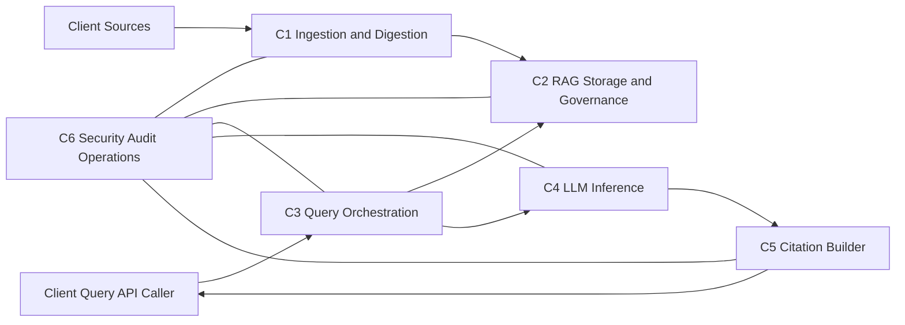
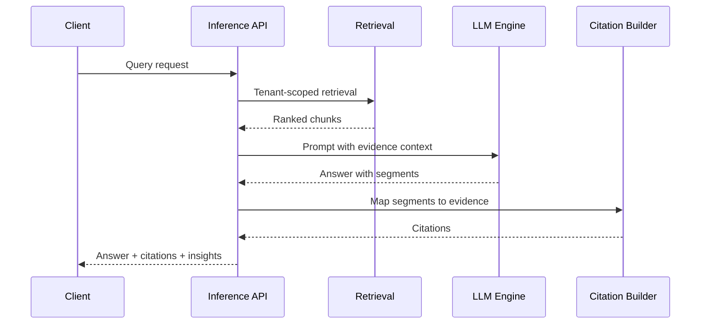

# Document Intelligence Platform Design

## 1) Component Design

### C1. Source Ingestion and Digestion
- Inputs: `txt`, `pdf`, `docx`, `xlsx`.
- Tenant separation at ingestion: each client is mapped to a dedicated source folder/prefix.
- Folder contract: `/{tenant_id}/...` (or configured equivalent) is the ingestion boundary.
- Full sync: initial crawl and indexing of all source material.
- Delta sync: create/update/delete from events plus periodic reconciliation scan.
- Delta checkpoints are tracked per tenant folder/prefix.
- Extraction by parser plugin:
  - `txt`: line/paragraph extraction.
  - `pdf`: text extraction with OCR fallback.
  - `docx`: headings, paragraphs, tables.
  - `xlsx`: all sheets, table regions, row/cell values, formula metadata.
- Output: normalized chunks with provenance metadata.

### C2. Tenant-Isolated RAG Storage and Index Governance
- Stores:
  - Raw object store for source snapshots.
  - Metadata store for source/doc/version/chunk records.
  - Vector index for embeddings.
- Isolation: all records partitioned by `tenant_id`; retrieval requires tenant filter.
- Ingestion routing: folder/prefix -> `tenant_id` resolution is required before processing.
- Governance: active/inactive document versions, tombstones for deletes, idempotent upsert keys.

### C3. Query Orchestration and Retrieval
- Validates tenant and query policy.
- Optional query rewrite.
- Retrieves top-k evidence from tenant index (hybrid retrieval supported).
- Reranks and composes context window for generation.

### C4. LLM Inference and Answer Synthesis
- Uses only retrieved evidence context.
- Produces answer and optional insights.
- Returns structured claim/sentence segments for citation binding.
- Abstains when evidence is insufficient.

### C5. Citation and Source-Link Builder
- Maps answer segments to chunk-level evidence.
- Builds citations using source metadata (`source_uri`, title, version, anchor).
- Enforces citation coverage for factual claims.

### C6. Security, Audit, and Operations
- AuthN/AuthZ at tenant boundary.
- Audit log for ingestion runs and inference requests.
- Reliability: retries, dead-letter queues, replay support.
- Metrics: ingestion lag, extraction failures, retrieval quality, inference latency.

### Component Interaction


## 2) RAG Design and Data Model

### Storage Model
- `RawStore`: original files and extraction artifacts.
- `MetadataDB`: tenant/source/document/version/chunk metadata.
- `VectorDB`: embedding vectors and retrieval fields.

### Core Entities
- `Tenant`: `tenant_id`, `name`, `status`.
- `Source`: `source_id`, `tenant_id`, `type`, `config_ref`, `root_path`, `sync_mode`, `checkpoint`.
- `Document`: `doc_id`, `tenant_id`, `source_id`, `source_doc_id`, `relative_path`, `status`.
- `DocumentVersion`: `doc_version_id`, `doc_id`, `version_tag`, `checksum`, `is_active`, `ingested_at`.
- `Chunk`: `chunk_id`, `doc_version_id`, `tenant_id`, `text`, `token_count`, `anchor_type`, `anchor_value`.
- `Embedding`: `embedding_id`, `chunk_id`, `tenant_id`, `vector`, `model_id`.
- `IngestionCursor`: `tenant_id`, `source_id`, `root_path`, `cursor`, `last_scan_at`.

### Required Chunk Metadata
- `tenant_id`
- `source_id`
- `source_doc_id`
- `doc_id`
- `doc_version`
- `chunk_id`
- `title`
- `source_uri`
- `anchor_type`
- `anchor_value`
- `ingested_at`
- `checksum`

### Anchor Model by Format
- `txt`: `anchor_type=line_range`, `anchor_value=12-26`.
- `pdf`: `anchor_type=page`, `anchor_value=7`.
- `docx`: `anchor_type=section_paragraph`, `anchor_value=Risk Factors:14`.
- `xlsx`: `anchor_type=sheet_range`, `anchor_value=Revenue!B12:D18`.

### Indexing and Lifecycle Rules
- Idempotency key: `tenant_id + source_id + source_doc_id + version_tag_or_checksum`.
- Update: new `DocumentVersion`, mark prior active version inactive only after successful reindex.
- Delete: mark document tombstoned and remove/deactivate active vectors.
- Delta detection is folder-scoped and uses `IngestionCursor` per tenant root path.
- Retrieval always scoped by `tenant_id`.

## 3) API Design and Models

### 3.1 Source and Ingestion APIs
- `POST /v1/tenants/{tenant_id}/sources`
  - Registers a source connector and tenant folder/prefix binding (`root_path`).
- `POST /v1/tenants/{tenant_id}/sources/{source_id}/sync/full`
  - Starts full ingestion.
- `POST /v1/tenants/{tenant_id}/sources/{source_id}/sync/delta`
  - Starts delta ingestion.
- `GET /v1/tenants/{tenant_id}/ingestion-runs/{run_id}`
  - Returns ingestion run status and counts.

### 3.2 Inference API
- `POST /v1/tenants/{tenant_id}/inference/query`

Request model:
```json
{
  "query": "What are top revenue risks in FY2025?",
  "filters": {
    "source_ids": ["src_finance"],
    "doc_ids": ["doc_123"],
    "date_from": "2025-01-01",
    "date_to": "2025-12-31"
  },
  "top_k": 12,
  "include_insights": true,
  "answer_style": "concise"
}
```

Response model:
```json
{
  "answer": "Revenue concentration risk is highest in two customer segments.",
  "insights": [
    "Segment A contributes 42% of annual revenue."
  ],
  "answer_segments": [
    {
      "segment_id": "s1",
      "text": "Revenue concentration risk is highest in two customer segments.",
      "citation_ids": ["c1", "c2"]
    }
  ],
  "citations": [
    {
      "citation_id": "c1",
      "source_uri": "s3://tenant-a/finance/fy2025.xlsx",
      "title": "FY2025 Revenue Workbook",
      "source_doc_id": "fin_2025",
      "doc_version": "v3",
      "anchor_type": "sheet_range",
      "anchor_value": "Revenue!B12:D18",
      "snippet": "Top two segments contribute 42% and 21%"
    }
  ],
  "confidence": 0.84,
  "trace_id": "trc_01"
}
```

### 3.3 Inference Runtime Sequence

