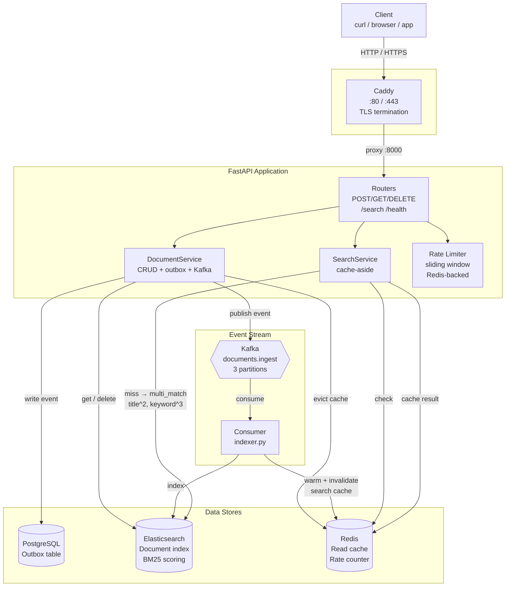

# DocEx — Distributed Document Search Service

A prototype distributed document search service with multi-tenancy, full-text search, async ingest pipeline, caching, and rate limiting. Built with FastAPI, Elasticsearch, Apache Kafka, and Redis.

## Prerequisites

- [Docker](https://docs.docker.com/engine/install/) + [Docker Compose](https://docs.docker.com/compose/install/)
- Internet connection (for image pulls and initial seed data)

## Quick Start

### One-command deploy (recommended)

```bash
git clone https://github.com/varun4/docex.git
cd docex
./scripts/deploy.sh --seed
```

The deploy script handles everything: Docker install (if missing), `.env` config, service startup, DB/ES initialization, and optional seed data import.

For a public instance with HTTPS:

```bash
./scripts/deploy.sh --domain docex.example.com --email admin@example.com --seed
```

### Manual setup

```bash
# 1. Clone and configure
git clone <repo-url>
cd docex
cp .env.example .env

# 2. Start all infrastructure
docker compose up -d

# 3. Create database schema (outbox table)
docker compose run app python scripts/init_db.py

# 4. Create Elasticsearch index
docker compose run app python scripts/init_es.py

# 5. (Optional) Seed data from Stardew Valley Wiki (~2,800 articles)
docker compose run app python scripts/seed.py --output data/seed.jsonl

# 6. (Optional) Import seed data via API
docker compose run app python scripts/bulk_import.py data/seed.jsonl --api http://app:8000 --tenant stardewvalley
```

The API is available at `http://localhost` (or `https://your.domain` with `--domain`). Documents are ingested asynchronously — `POST /api/v1/documents` returns immediately with an `event_id`, and the consumer process indexes into Elasticsearch in the background.

## Usage

```bash
# Index a document (async — returns 202 with event_id)
curl -X POST "http://localhost/api/v1/documents" \
  -H "X-Tenant-ID: stardewvalley" \
  -H "Content-Type: application/json" \
  -d '{"title": "Stardrop", "content": "A rare fruit that empowers those who eat it."}'

# Search documents
curl "http://localhost/api/v1/search?q=stardrop&page=1&size=10" \
  -H "X-Tenant-ID: stardewvalley"

# Get document by ID
curl "http://localhost/api/v1/documents/<id>" \
  -H "X-Tenant-ID: stardewvalley"

# Delete document
curl -X DELETE "http://localhost/api/v1/documents/<id>" \
  -H "X-Tenant-ID: stardewvalley"

# Health check
curl http://localhost/api/v1/health
```

## Scripts

| Script | Description | Run via | Key flags |
|--------|-------------|---------|-----------|
| `scripts/deploy.sh` | Full bootstrap — installs Docker, configures `.env`, starts services, inits DB/ES, optionally seeds data | `./scripts/deploy.sh` (host) | `--domain`, `--email`, `--seed` |
| `scripts/seed.py` | Fetch pages from a MediaWiki API and save as JSONL | `docker compose run --rm app python scripts/seed.py` | `--output`, `--api` |
| `scripts/bulk_import.py` | Import JSONL documents into the API with rate-throttled batch POSTs | `docker compose run --rm app python scripts/bulk_import.py` | `--api`, `--tenant`, `--rate`, `--batch` |
| `scripts/init_db.py` | Create/update PostgreSQL outbox schema (idempotent) | `docker compose run --rm app python scripts/init_db.py` | `--db-url` |
| `scripts/init_es.py` | Create Elasticsearch index with document mapping (idempotent) | `docker compose run --rm app python scripts/init_es.py` | `--es-url` |

## Project Structure

```
docex/
├── app/                    # FastAPI application
│   ├── main.py
│   ├── config.py
│   ├── routers/            # API endpoints
│   ├── schemas/            # Pydantic models
│   ├── services/           # Business logic
│   ├── repositories/       # Data access (ES + Redis + PG outbox)
│   └── kafka/              # Async Kafka producer
├── consumer/               # Background worker (separate process)
│   ├── main.py             # Kafka consumer loop
│   └── indexer.py          # ES indexer + cache warmer
├── scripts/                # Utility scripts
│   ├── seed.py
│   ├── bulk_import.py
│   ├── init_db.py
│   └── init_es.py
├── data/                   # Generated seed data (gitignored)
├── docker-compose.yml
├── Dockerfile
├── Dockerfile.consumer
└── requirements.txt
```

## API Endpoints

| Method | Path | Auth | Response | Description |
|---|---|---|---|---|---|
| POST | `/api/v1/documents` | `X-Tenant-ID` | `202 {id, event_id, status: "pending"}` | Async document ingest |
| GET | `/api/v1/search?q=&page=&size=` | `X-Tenant-ID` | `200 {results[], total, page, size}` | Full-text search via Elasticsearch |
| GET | `/api/v1/documents/{id}` | `X-Tenant-ID` | `200` document / `404` | Retrieve document from ES |
| DELETE | `/api/v1/documents/{id}` | `X-Tenant-ID` | `200` / `404` | Delete document from ES |
| GET | `/health` | — | `200` / `503` | Health check (PG, Redis, ES, Kafka) |

## Architecture



### Component summary

| Component | Role |
|-----------|------|
| **Caddy** | Reverse proxy — terminates TLS, auto HTTPS via Let's Encrypt |
| **FastAPI** | HTTP API — POST/GET/DELETE documents, full-text search, health |
| **PostgreSQL** | Outbox table only — event journal for async ingest |
| **Kafka** | Event stream — 3 partitions, partitioned by `tenant_id` |
| **Consumer** | Background worker — reads Kafka, indexes into ES, warms Redis |
| **Elasticsearch** | Document store + search index — BM25 scoring, multi-match |
| **Redis** | Read cache (cache-aside) + sliding window rate limiter |

### Ingest Flow (async)
```
POST /api/v1/documents ──▶ PG Outbox ──▶ Kafka ──▶ Consumer ──▶ Elasticsearch
                                               │
                                               └──▶ Redis (cache warm + invalidate)
```

### Search Flow (cache-aside)
```
GET /api/v1/search ──▶ Redis (check cache)
                  ├── HIT  ──▶ return cached
                  └── MISS ──▶ Elasticsearch (multi_match, title^2 + keyword^3)
                               └──▶ cache result in Redis ──▶ return
```

## Production Readiness

Features implemented to improve production readiness:

| Feature | Description |
|---|---|
| **Request ID** | `X-Request-ID` header injected into every response for request tracing |
| **Rate limit headers** | `X-RateLimit-Limit` and `X-RateLimit-Remaining` returned on all rate-limited routes |
| **Prometheus metrics** | `/metrics` endpoint exposes request counts, duration histogram, cache hit/miss, connection pool size, and error counts |
| **Structured error codes** | All errors use `ErrorCode` enum (`/app/enums.py`), returned as `{"error": {"code": ..., "message": ..., "detail": ...}}` |
| **Configurable via env** | Rate limits, cache TTLs, pool sizes, ES/Kafka settings all configurable through `.env` |
| **Async ingest** | Outbox + Kafka + consumer decouples ingest from search indexing |
| **Graceful degradation** | Health check reports per-dependency status with latency |

See `.env.example` for all available configuration options.
